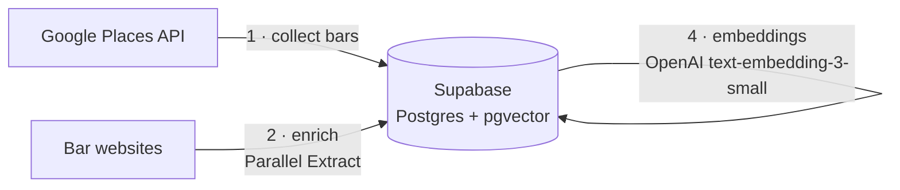
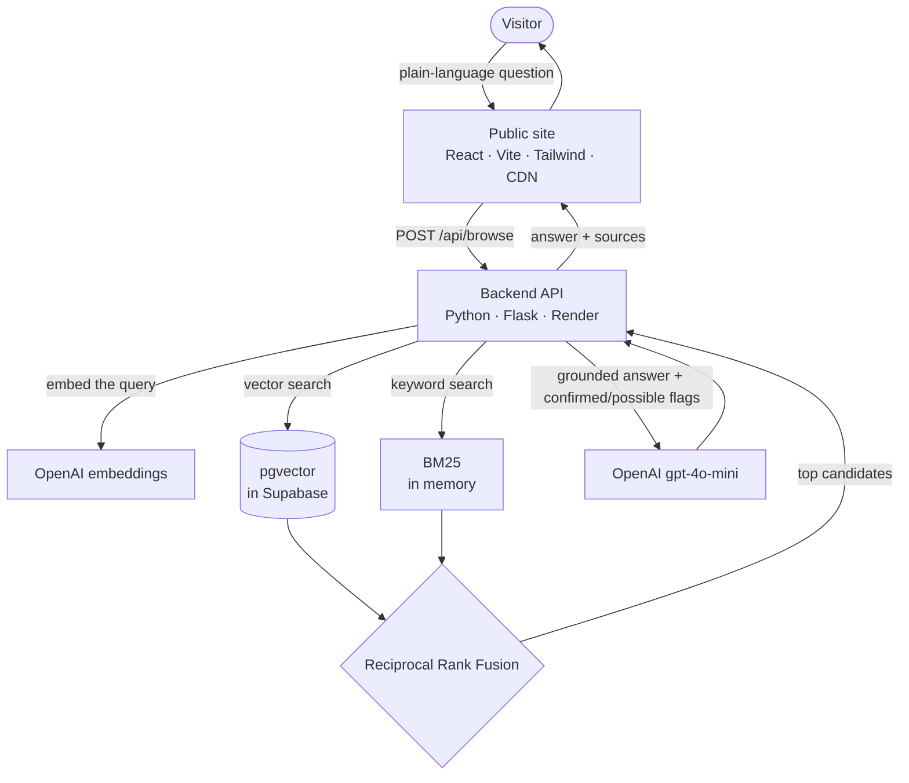
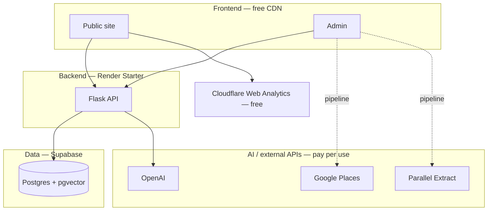

# Architecture & Costs

How BacaroHop is put together, and what it costs to run at different traffic levels.

## How the web app works

The system has two flows: an **admin pipeline** that builds the catalogue (run occasionally), and the **live search** that visitors use (runs on every request).

### 1 — Data pipeline (admin, run occasionally)

### 2 — Live search (per visitor)

The public site and admin are separate static apps on a CDN; the backend is an API-only Flask service; the database is reachable only from the backend.

## Tools we use and why

| Tool | What it does | Billing model |
|---|---|---|
| **Render** | Hosts the backend API (always-on) + the two static frontends | Backend: flat **$7/mo** (Starter). Static sites: **free** |
| **Supabase** | Postgres database + `pgvector` for embeddings + search logs | **Free** tier (up to 500 MB); **$25/mo** (Pro) only at larger scale |
| **OpenAI** | Query embeddings, the RAG answer, tagging/blurbs | Pay per token — see below |
| **Google Places API** | Collecting bars (Text Search) + geocoding place names in queries | Pay per request; monthly free tier |
| **Parallel Extract** | Scraping cicchetti content from bar websites | Pay per request; monthly free tier |
| **Cloudflare Web Analytics** | Privacy-friendly page analytics | **Free** |

## What it costs at different volumes

Two kinds of cost:

- **Traffic-driven** (grows with visitors): OpenAI per search, and Google geocoding when a query names a place.
- **Fixed / occasional**: Render is flat; the admin pipeline (collect/enrich/tag/index) is run occasionally, not per visitor.

### Unit prices (verified 2026, always re-check — free tiers reset monthly)

| Service | Unit price | Monthly free tier |
|---|---|---|
| OpenAI `gpt-4o-mini` | $0.15 / 1M input tokens · $0.60 / 1M output | — |
| OpenAI `text-embedding-3-small` | $0.02 / 1M tokens | — |
| Google Places — Text Search (Pro) | $32 / 1,000 requests | first 5,000 / mo free |
| Google Places — Geocoding | $5 / 1,000 requests | first 10,000 / mo free |
| Parallel Extract | $1 / 1,000 requests ($0.001 each) | first 5,000 / mo free |
| Render Starter (backend) | $7 / month (flat) | — |
| Supabase | $0 (free) → $25/mo (Pro) | free tier |
| Cloudflare Web Analytics | $0 | free |

### Estimated monthly total by traffic

Assumptions: ~**$0.001 of OpenAI per search** (embedding + RAG answer over ~8 candidates); ~30% of queries name a place (so they geocode).

| | Low — friends (~500 searches/mo) | Medium (~10,000/mo) | High (~100,000/mo) |
|---|---|---|---|
| Render (backend) | $7 | $7 | $7 |
| Supabase | $0 (free) | $0 (free) | ~$25 (Pro) |
| Cloudflare | $0 | $0 | $0 |
| OpenAI — search | ~$0.50 | ~$10 | ~$100 |
| Google — geocoding | $0 (free) | $0 (free) | ~$100¹ |
| **≈ Total / month** | **≈ $7.50** | **≈ $17** | **≈ $230** |

¹ Geocoding is the one that bites at high volume — and it's easily cut by **caching** results for repeated place names (most people ask about the same landmarks).

**Occasional (per full data refresh, not monthly):** collecting via Google Places is ~90 Text Search calls (≈ $0, covered by the 5,000/mo free tier; ≈ $3 if you're already over it); Parallel enrichment of ~230 sites ≈ $0 (free tier); OpenAI tagging + indexing ≈ $0.35.

### The takeaway

At friends scale it's essentially **the $7 Render bill plus pennies**. The only cost that grows with users is OpenAI (cheap per search) and, at high volume, Google geocoding (cacheable). Everything else is free-tier or flat until the project genuinely takes off.

> Prices are approximate and change — treat this as a planning estimate, not a quote. Free tiers reset every month.
